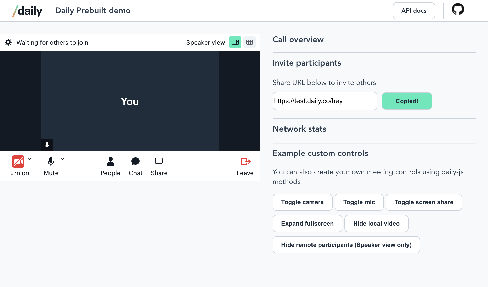
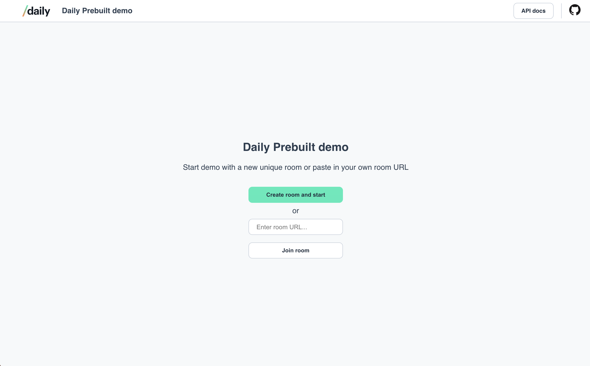

# Daily Prebuilt: Vue demo



## Requirements

To use this demo, you will first need to [create a Daily account](https://dashboard.daily.co/signup). You will need your Daily API key, which can be found on the [Developers](https://dashboard.daily.co/developers) page, if you want to create new rooms through the demo UI.

You can use existing Daily rooms in the demo by pasting the room URL into the input. The room URL should be in this format to be valid: `https://domain-name.daily.co/room-name`, with `daily-domain` changed to your domain, and `room-name` changed to the name of the existing room you would like to use.



---

## Running locally

To run this demo locally:

1. Install dependencies `npm install`
2. Start dev server `npm run serve`
3. Then open your browser and go to http://localhost:8080

OR...

## Running using Netlify CLI

If you want access to the Daily REST API (using the proxy as specified in `netlify.toml`) as well as a more robust local dev environment, please do the following in this project's directory:

1. Deploy to your Netlify account

   [](https://app.netlify.com/start/deploy?repository=https://github.com/daily-demos/vue-daily-prebuilt)

   Note: You'll need your [Daily API key](https://dashboard.daily.co/developers) handy for this step.

2. Install the Netlify CLI `npm i -g netlify-cli`
3. Login to your account `netlify login`
4. Rename `sample.env` to `.env` and add your API key
5. Start the dev server `netlify dev`

> Note: If the API proxy isn't working locally you may need to run `netlify build` first. This will put API key in the `netlify.toml` file, so make sure you don't commit this change.

### Compile and minify for production

```
npm run build
```

### Lint and fix files

```
npm run lint
```
